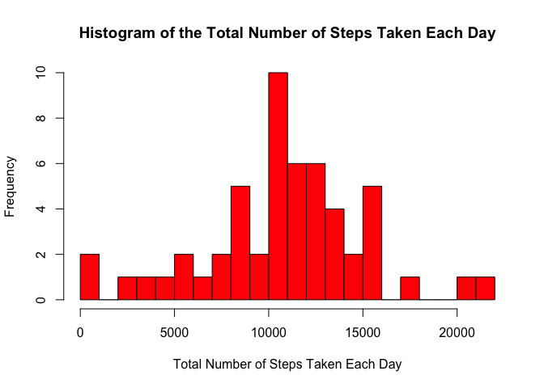
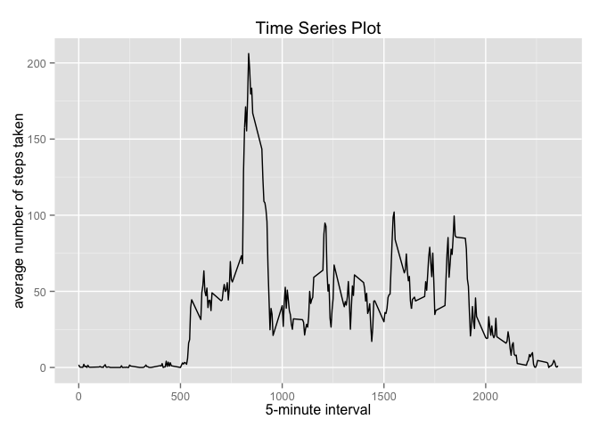
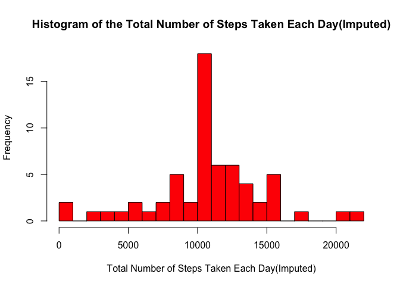
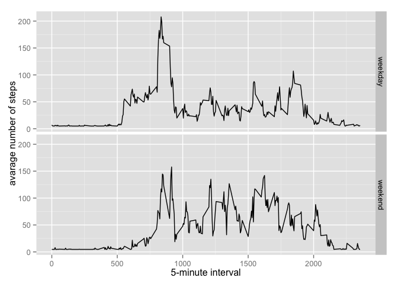

# Reproducible Research: Peer Assessment 1


```r
library(ggplot2)
library(Hmisc)
```

```
## Loading required package: grid
## Loading required package: lattice
## Loading required package: survival
## Loading required package: Formula
## 
## Attaching package: 'Hmisc'
## 
## The following objects are masked from 'package:base':
## 
##     format.pval, round.POSIXt, trunc.POSIXt, units
```

## Loading and preprocessing the data

#### 1.Loading the data

```r
if(!file.exists('activity.csv')){
    download.file('https://d396qusza40orc.cloudfront.net/repdata%2Fdata%2Factivity.zip', 
                  destfile = 'activity.csv', method = 'curl')
    unzip('repdata-data-activity.zip')
}
activityDF <- read.csv('activity.csv')
```
#### Display activityDF

```r
head(activityDF,5)
```

```
##   steps       date interval
## 1    NA 2012-10-01        0
## 2    NA 2012-10-01        5
## 3    NA 2012-10-01       10
## 4    NA 2012-10-01       15
## 5    NA 2012-10-01       20
```
#### 2.Process/transform the data (if necessary) into a format suitable for your analysis

```r
activityDF$date <- as.Date(activityDF$date, "%Y-%m-%d")
```
## What is mean total number of steps taken per day?

#### 1.Calculate the total number of steps taken per day

```r
totalStepsPerDay <- aggregate(steps ~ date, data = activityDF, sum, na.rm = T)
```
#### Display aggregated data of steps per day

```r
head(totalStepsPerDay,5)
```

```
##         date steps
## 1 2012-10-02   126
## 2 2012-10-03 11352
## 3 2012-10-04 12116
## 4 2012-10-05 13294
## 5 2012-10-06 15420
```
#### 2.Histogram of total number of steps taken each day

```r
hist(
        totalStepsPerDay$steps,
        col = "red",
        main = "Histogram of the Total Number of Steps Taken Each Day",
        xlab = "Total Number of Steps Taken Each Day",
        breaks = 20
)
```

 


#### 3.Calculate and report the mean and median of the total number of steps taken per day

```r
# mean
round(mean(totalStepsPerDay$steps, na.rm = T))
```

```
## [1] 10766
```

```r
# median
median(totalStepsPerDay$steps, na.rm = T)
```

```
## [1] 10765
```

## What is the average daily activity pattern?
#### 1.Time series plot (i.e. `type = "l"`) of the 5-minute interval (x-axis) and the average number of steps taken, averaged across all days (y-axis)

```r
meanStepsPerInterval <- aggregate(steps ~ interval, data = activityDF, FUN = mean, na.rm = T)
names(meanStepsPerInterval)[2] <- 'meanSteps'
head(meanStepsPerInterval, 5)
```

```
##   interval meanSteps
## 1        0 1.7169811
## 2        5 0.3396226
## 3       10 0.1320755
## 4       15 0.1509434
## 5       20 0.0754717
```

```r
ggplot(data=meanStepsPerInterval, aes(x=interval, y=meanSteps)) +
    geom_line() +
    ggtitle('Time Series Plot')+
    xlab("5-minute interval") +
    ylab("average number of steps taken")
```

 


#### 2.Which 5-minute interval, on average across all the days in the dataset, contains the maximum number of steps?

```r
maxMeanStepsIndex <- which.max(meanStepsPerInterval$meanSteps)
meanStepsPerInterval[maxMeanStepsIndex,]
```

```
##     interval meanSteps
## 104      835  206.1698
```
result interval : 835


## Imputing missing values
#### 1.Calculate and report the total number of missing values in the dataset (i.e. the total number of rows with `NA`s)

```r
nrow(activityDF[is.na(activityDF$steps),])
```

```
## [1] 2304
```
#### 2.Devise a strategy for filling in all of the missing values in the dataset. The strategy does not need to be sophisticated. For example, you could use the mean/median for that day, or the mean for that 5-minute interval, etc.

To the mean for the 5-minute interval for the missing values.

#### 3.Create a new dataset that is equal to the original dataset but with the missing data filled in.


```r
newDF <- activityDF
newDF$steps <- impute(activityDF$steps, fun=mean)
head(newDF, 5)
```

```
##     steps       date interval
## 1 37.3826 2012-10-01        0
## 2 37.3826 2012-10-01        5
## 3 37.3826 2012-10-01       10
## 4 37.3826 2012-10-01       15
## 5 37.3826 2012-10-01       20
```

#### 4.Make a histogram of the total number of steps taken each day and Calculate and report the mean and median total number of steps taken per day. 

```r
newTotalStepsPerDay <- aggregate(steps ~ date, data = newDF, sum, na.rm = T)
head(newTotalStepsPerDay, 5)
```

```
##         date    steps
## 1 2012-10-01 10766.19
## 2 2012-10-02   126.00
## 3 2012-10-03 11352.00
## 4 2012-10-04 12116.00
## 5 2012-10-05 13294.00
```

```r
hist(
        newTotalStepsPerDay$steps,
        col = "red",
        main = "Histogram of the Total Number of Steps Taken Each Day(Imputed)",
        xlab = "Total Number of Steps Taken Each Day(Imputed)",
        breaks = 20
)
```

 

```r
# mean
round(mean(newTotalStepsPerDay$steps, na.rm = T))
```

```
## [1] 10766
```

```r
# median
round(median(newTotalStepsPerDay$steps, na.rm = T))
```

```
## [1] 10766
```
#### Do these values differ from the estimates from the first part of the assignment? What is the impact of imputing missing data on the estimates of the total daily number of steps?

Yes, they are slightly different. 

mean : 10766 -> 10766

median : 10765 -> 10766

Since the value I use is the mean steps per interval, as the diagram shows, the frequency of the average steps per day largely increases.

## Are there differences in activity patterns between weekdays and weekends?
#### 1.Create a new factor variable in the dataset with two levels – “weekday” and “weekend” indicating whether a given date is a weekday or weekend day.


```r
newDF$dateType <-  ifelse(as.POSIXlt(newDF$date)$wday %in% c(0,6), 'weekend', 'weekday')
```

#### 2.Make a panel plot containing a time series plot (i.e. `type = "l"`) of the 5-minute interval (x-axis) and the average number of steps taken, averaged across all weekday days or weekend days (y-axis). See the README file in the GitHub repository to see an example of what this plot should look like using simulated data.


```r
aggregatedNewDF <- aggregate(steps ~ (interval + dateType), data=newDF, mean)
ggplot(aggregatedNewDF, aes(interval, steps)) + 
    geom_line() + 
    facet_grid(dateType ~ .) +
    xlab("5-minute interval") + 
    ylab("avarage number of steps")
```

 

